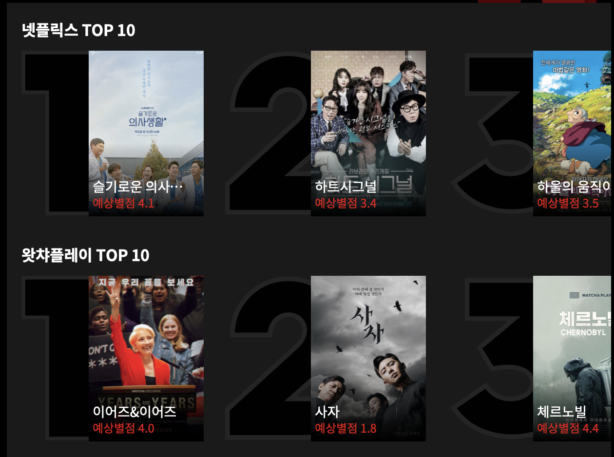
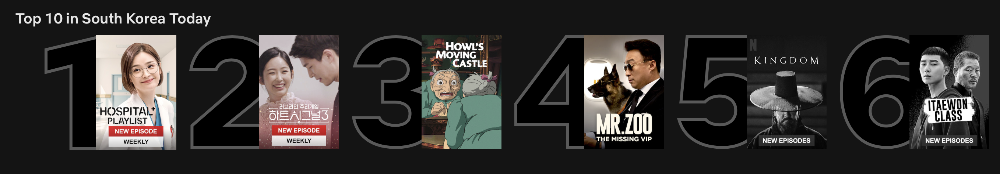
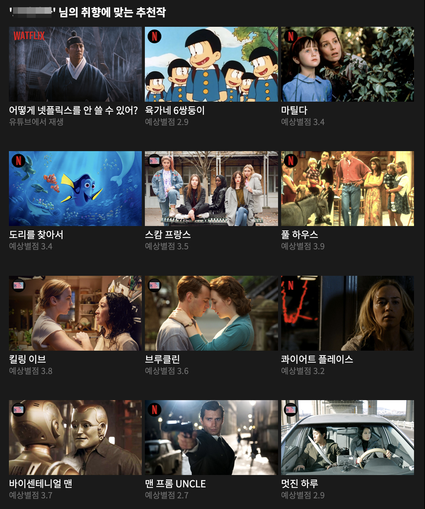
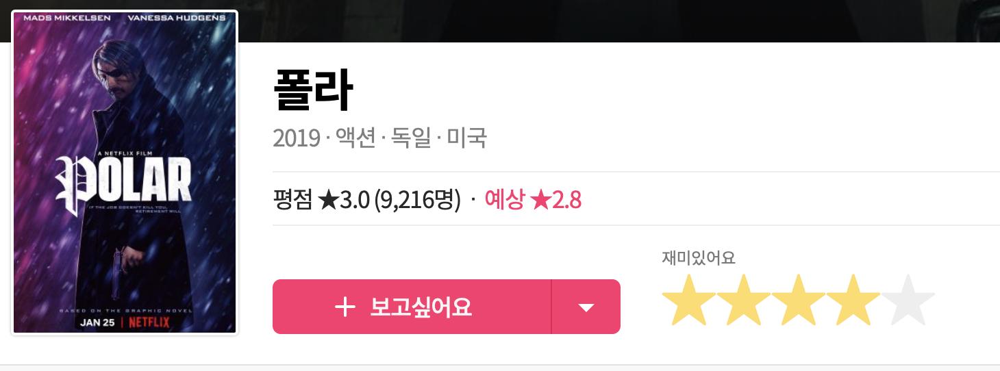
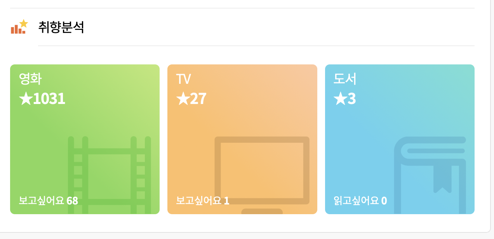

* <a href="https://www.netflix.com/kr/n/6HQZ9AP3-2" target="_blank" >넷플릭스</a>
* <a href="https://play.watcha.net" target="_blank" >왓챠플레이</a>

왓챠에서 4월 1일 <a href="https://watcha.com/netflix" target="_blank" >왓플릭스</a> 서비스를 출시 한다고 해서 궁금해서 서비스를 이용해 봤습니다.

왓챠 입장에서는 넷플릭스가 경쟁 상대일텐데 과연 경쟁 서비스를 추천해 줄까? 하는 의문도 있었고 과거 왓챠 추천 서비스를 재미있게 사용한 경험이 있기도 해서 
왓플릭스를 써 보기로 했습니다.

지극히 개인적인 평가라는 점은 감안하고 글을 읽어 주시기를 부탁드립니다. 

자, 그럼 왓플릭스를 살펴볼까요?

첫 상단에 넷플릭스 Top10과 왓챠플레이 Top10을 보여주네요. Top10은 넷플릭스에서 기본으로 보여주는 추천으로 왓챠플레이 Top10 끼워넣기로 보여집니다. 
아래는 넷플릭스에 있는 Top10 배너...

(제가 넷플릭스 언어를 영어로 설정해놔서 약간 다르게 보일 수 있습니다.)

그 다음 메인 추천 리스트입니다. 

첫번째는 왓플릭스 홍보 영상이네요. 두번째부터 추천인데 넷플릭스 컨텐츠만 추천해 주는 것이 아니고 왓챠 플레이 컨텐츠랑 같이 추천이 나오는군요. 
역시 그냥 추천 서비스를 해 주는건 아니였네요.

하지만 왜 예상 별점이 낮은 영화가 추천이 나오는지 모르겠습니다. 그리고 예상 별점 순서대로 추천이 되는 것도 아니네요.

선호 장르나 배우/감독 또는 저랑 취향이 비슷한 사람이 재미있게 본 컨텐츠라던가... 이런 설명이 좀 달려 있으면 좋을텐데요.

그래도 추천 결과가 좋다면...

하지만 그렇지도 않네요. 하나 예를 들자면 전 폴라를 4점을 줬지만 예상 별점은 2.8점 입니다.

참고로 저의 영화 평가 내역입니다. 이 정도면 데이터가 부족해서 추천을 못하는 건 아니겠죠? 😏

왓챠 추천 결과는 별로 신뢰 하지 않습니만 사실 내가 본 영화들을 평가/관리하기에는 왓챠만한 것이 없기도 합니다. 좀 더 분발해서 외산 OTT 서비스의 대체재가 되길 바랍니다.

👍
